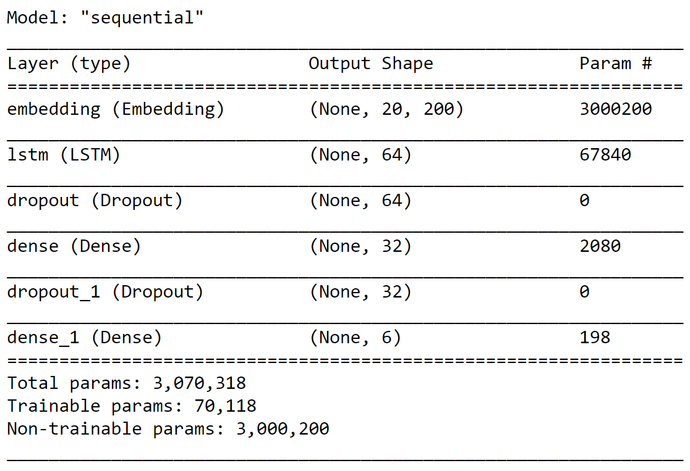

# text-emotion-detection
Detection of type of emotion conveyed by any text

## Contents
* [Overview](#overview)
* [Motivation](#motivation)
* [Dataset](#dataset)
* [Setup](#setup)
* [Repository files](#repository-files)
* [Model](#model)
* [What did I learn](#what-did-i-learn)

## Overview
An LSTM model that detects which of the following emotions are conveyed by the input text - joy, sadness, anger, fear, love, and surprise. Word embeddings were created using glove embeddings.

## Motivation
Emotion detection is closely related to Sentiment analysis. Recognition of emotion is one of the key aspects to improve human-machine interaction. This can be an important part of emotion detection using speech or audio.

## Dataset
The dataset was downloaded from Kaggle 
Website: [twitter dataset](https://www.kaggle.com/praveengovi/emotions-dataset-for-nlp)

## Setup
Windows 10 
python 3.7 
tensorflow-gpu==2.1.0

## Repository files
emotion_detection_text_dataset  : contains dataset (both original and after pre processing)
saved_model_text_classification : saved TensorFlow model
emotion_detection_2.ipnyb       : jupyter notebook 
model_layers.png                : image for training model used
text_cleaning.py                : custom python function to clean data for efficient tokanization

## Model

  

## What did I learn?
#### Problem: 
Solution: 

#### Problem: 
Solution: 

